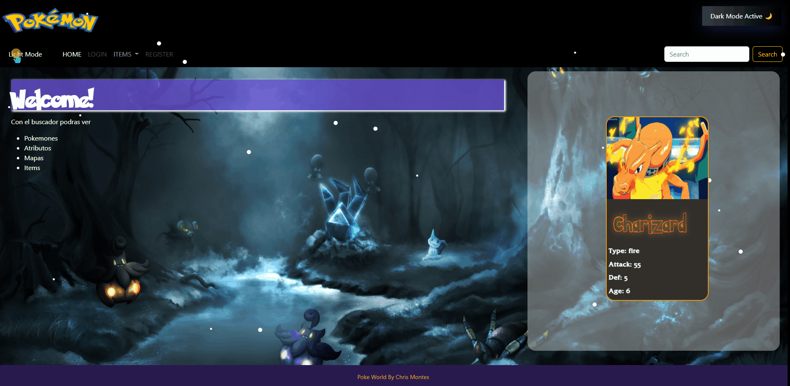

# Poke World
> Es una aplicación web donde puedes buscar pokemones de un JSON local del proyecto. Accediendo a su informacion, atributos y imagenes

## ⚡ Lenguajes y Frameworks utilizados

     </a> 

## ☄ Interface
